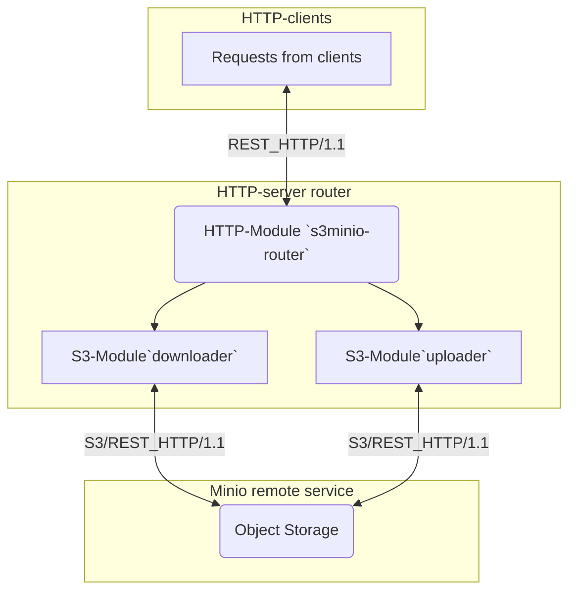
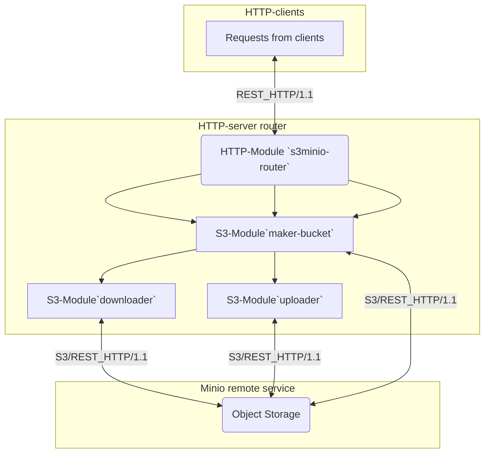

## Сервис-роутер для обмена данными с Minio Object Storage.


### Содержание
- [Сборка и тестирование](https://github.com/blablatov/s3minio-router#сборка-локально)
- [Схема сервиса](https://github.com/blablatov/s3minio-router#блок-схема-сервиса)
- [Схема сервиса](https://github.com/blablatov/s3minio-router#создание-бакета)


### Описание
* Endpoint сервиса.
Точка доступа для клиентов к сервису реализована через `http`-запрос вида:
```sh
http://localhost:8080
```

* Загрузчик (`downloader`) для загрузки медиа файлов из бакета.
Скачиваемый медиа-контент, стримится в браузере, если последний поддерживает отображение видеоформата.
Форматы - `.gif`, `.mp4` загружаются с бакета `minio` в локальную папку `download` и оттуда стримятся в браузере. Форматы - `.avi`, `.mkv` только загружаются в эту папку. Для их отображение необходимо использовать сторонние кодеки.

Точка доступа к этому загрузчику:
```sh
http://localhost:8080/stream/<filename.extension>
```
* Загрузчик (`uploader`) для выгрузки медиа файлов в бакет.
Выгружает выбранный файл из локальной папки `upload` и сохраняет с нужным названием в бакет `minio`.
Точка доступа к этому загрузчику:
```sh
http://localhost:8080/upstream/<filename.extension>
```

### Сборка локально
[Содержание](https://github.com/blablatov/s3minio-router#содержание)

```sh
go build ./..
```

### Тестирование локально
```sh
go test -v .
```

### Использование
```sh
./s3minio-router
```


### Блок-схема сервиса
[Содержание](https://github.com/blablatov/s3minio-router#содержание)




---

### Создание бакета
[Содержание](https://github.com/blablatov/s3minio-router#содержание)

* Получение `uuid` пользователя из заголовка `HTTP`-запроса.
Модулем `maker-bucket` выполняется проверка, если в `minio` есть бакет у которого название соответствует значению этого `uuid`, выполняется обмен данными с этим бакетом.
Если соответствующий бакет не найден, создается новый бакет у которого название соответствует значению этого нового `uuid`.
Каждый пользователь является владельцем бакета с названием как значение `uuid`.

### Блок-схема
[Содержание](https://github.com/blablatov/s3minio-router#содержание)


